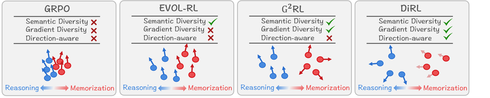

# DiRL: Direction-Aware Exploration in LLM Reinforcement Learning

This repository contains the official implementation of **DiRL**, a Direction-Aware Reinforcement Learning framework for improving reasoning in large language models.

DiRL is motivated by a simple observation: not all exploration is equally useful for reasoning. Existing exploration methods often encourage diversity in semantic or gradient spaces, but they do not distinguish whether the diversity comes from genuine reasoning or from memorization-driven variations. DiRL addresses this limitation by anchoring exploration to an internal **reasoning–memorization direction** extracted from the model's residual stream. This direction is then used to guide reward shaping during reinforcement learning, encouraging reasoning-aligned exploration while suppressing memorization-aligned shortcuts.

  

  <b>Figure 1.</b> Comparison of exploration strategies. Unlike prior diversity-based methods, DiRL selectively reinforces reasoning-aligned novelty while suppressing memorization-aligned variation.

## Overview

Reinforcement learning has become a key paradigm for eliciting reasoning abilities in large language models. However, effective exploration remains challenging. A sampled trajectory may be novel because it follows a new reasoning path, or because it merely varies memorized surface patterns. Rewarding both cases equally can mislead policy optimization.

DiRL introduces a direction-aware exploration mechanism with three key steps:

1. **Reasoning–Memorization Direction Extraction**  
   DiRL extracts a direction from the model's residual stream that separates reasoning-intensive and memorization-intensive behaviors.

2. **Direction-Weighted Gradient Features**  
   For each rollout, DiRL constructs gradient-like features weighted by the reasoning direction, so that exploration focuses on reasoning-relevant update signals.

3. **Direction-Aware Reward Shaping**  
   Rollouts are divided into reasoning-aligned and memorization-aligned groups. DiRL amplifies novel reasoning-aligned trajectories and suppresses memorization-aligned variations before computing GRPO advantages.

DiRL integrates naturally into standard **Group Relative Policy Optimization (GRPO)** without changing the clipped policy objective or KL regularization.

## Method

DiRL augments GRPO with a representation-aware exploration signal.

Given a policy model, DiRL first computes a fixed reasoning–memorization direction from hidden states of reasoning-intensive and memory-intensive prompts. During RL training, each sampled response is projected onto this direction to determine whether it is reasoning-aligned or memorization-aligned.

For each response, DiRL computes a direction-weighted gradient feature that captures how the response would update the policy along reasoning-relevant directions. The exploration score is then computed relative to the reasoning-aligned subgroup. Finally, this score is used to shape the original verifier reward:

- reasoning-aligned responses are encouraged when they introduce novel update directions;
- memorization-aligned responses are penalized when they deviate from reasoning-oriented updates.

This converts generic diversity rewards into optimization signals that more directly support reasoning improvement.

## Main Results

We evaluate DiRL on mathematical and general reasoning benchmarks using Qwen3-1.7B-Base and Qwen3-4B-Base.

DiRL consistently improves over GRPO, Entropy Bonus, EVOL-RL, and G²RL on:

- MATH500
- AMC
- AIME24
- AIME25
- GPQA
- MMLU-Pro
- GSM-Symbolic and its variants

The results show that DiRL improves pass@1, maj@16, and pass@16 across model scales. Further analysis shows that DiRL increases the proportion of reasoning-aligned rollouts, improves robustness under symbolic perturbations, and introduces only modest computational overhead.
